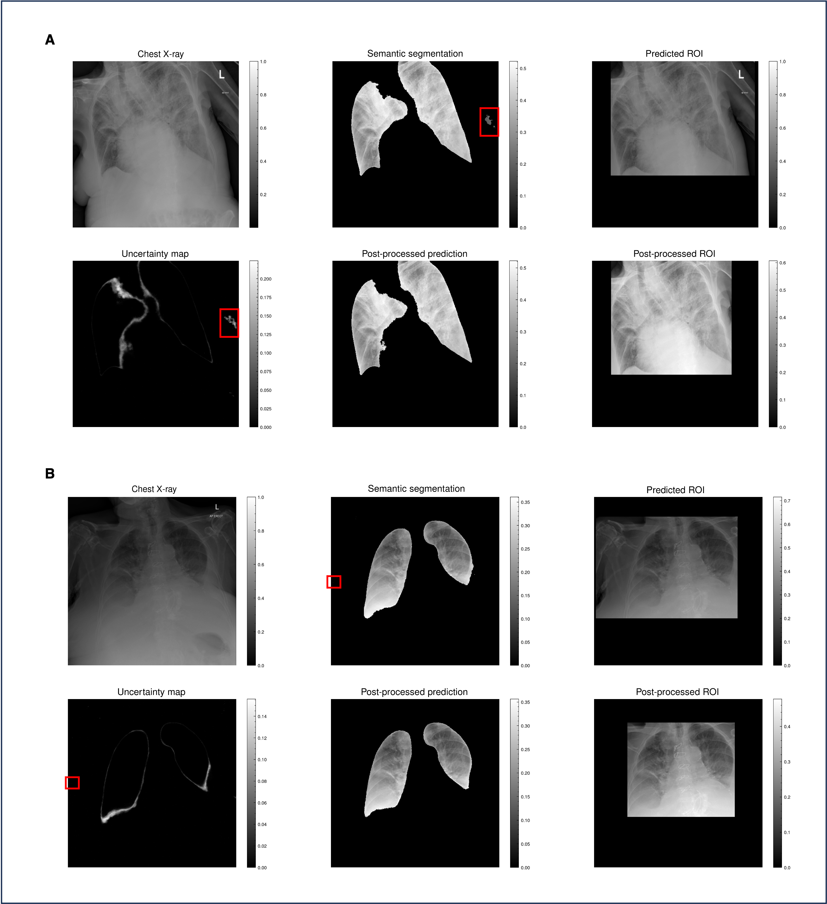

# **Uncertainty-based post-processing of semantic segmentations for robust region-of-interest extraction in CXRs**

## Overview

We use a UNet++ model to generate semantic segmentation of the left and right lung field. Then Monte Carlo dropout is applied to approximate uncertainty of prediction, total uncertainty is calculated and frequency of uncertainty is evaluated for Bimodality with Hartigans’ test.

In the example presented in Figure 1, uncertainty is less than the threshold for required manual evaluation and prediction uncertainty is bimodal so automatic post-processing is applied. In post-processing, unconnected structures are identified and the density of uncertainty is calculated. Excess structures (more than the two lung fields) are iteratively removed, with the most uncertain structures removed first. A ROI is generated from the post-processed semantic segmentation, the ROI was selected to be the minimum bounding box around the segmented lung fields

*Figure 1: Example of unsupervised lung segmentation post-processing algorithm on NCCID data.*

## Example use



*Figure 2: Post-processing of COVID-19 CXR semantic lung segmentation to generate reliable ROIs.*

We present two example cases in Fig. 2. a) Severe COVID-19 in a CXR resulting in uncertain (a total prediction uncertainty of 620), under-segmentation of the right lung field, the additional structure (highlighted in the semantic segmentation and uncertainty map) creates an overly large ROI around the lungs. Pixel-wise prediction uncertainty is used to isolate the extra structure, which is eliminated during post-processing of the semantic segmentation. b) A COVID-19 CXR with under-segmentation of the lung fields including pixels at the left border of the CXR. Pixel-wise uncertainty is used to remove this structure from the semantic segmentation before creating a post-processed ROI. Total prediction uncertainty of this example is 230.

## How to generate ROIs

Run the following command with the provided model weights `mcd_vgg_nest_unet_cxr_1.p`

```
python3 scripts/create_segmentations.py --data_csv path_to_cxrs --model_weights path_to_unet_weights
```
